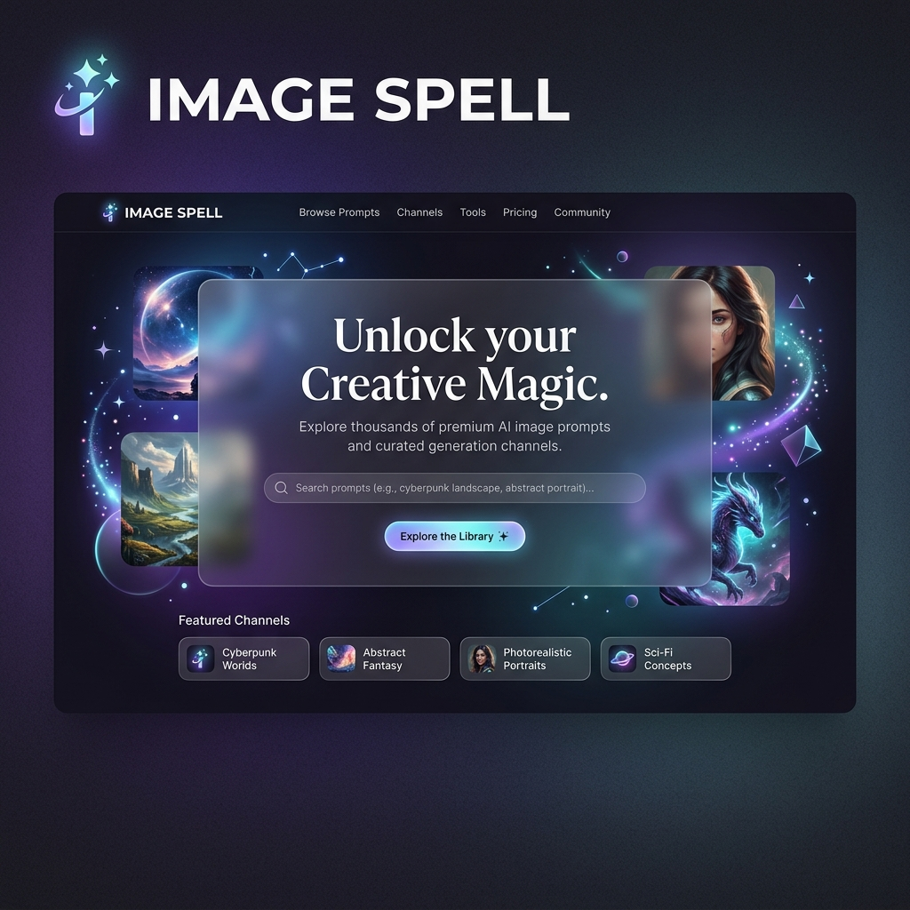

<div align="center">
  
  
  <h1>✨ Image Spell</h1>
  <p><b>Волшебный инструмент для обработки и манипуляции изображениями. Ваша библиотека высококачественных промптов и каналов для генерации ИИ-изображений.</b></p>
  
  <p>
    <a href="#описание">Описание</a> •
    <a href="#возможности">Возможности</a> •
    <a href="#установка">Установка</a>
  </p>
</div>

---

## 🔮 Описание
**Image Spell** — это стильный веб-каталог и библиотека, которая помогает пользователям ориентироваться в мире высококачественной генерации изображений с помощью ИИ. Проект поддерживает несколько языков и отличается современным дизайном с элементами glassmorphism (стекломорфизм) и "темной темой".

## 🚀 Возможности
- 🌍 **Мультиязычность**: Поддержка английского, русского, португальского и испанского языков.
- 🎨 **Современный UI**: Красивый темный дизайн, эффекты прозрачности и матового стекла.
- 📚 **Каталог промптов**: Обширная библиотека запросов для генерации потрясающих изображений.

## 💻 Установка
Проект представляет собой статический веб-сайт, поэтому установка очень проста:
1. Склонируйте репозиторий:
   ```bash
   git clone https://github.com/v1per4ever/imagespell.git
   ```
2. Откройте `index.html` в вашем любимом браузере или запустите через Live Server.
